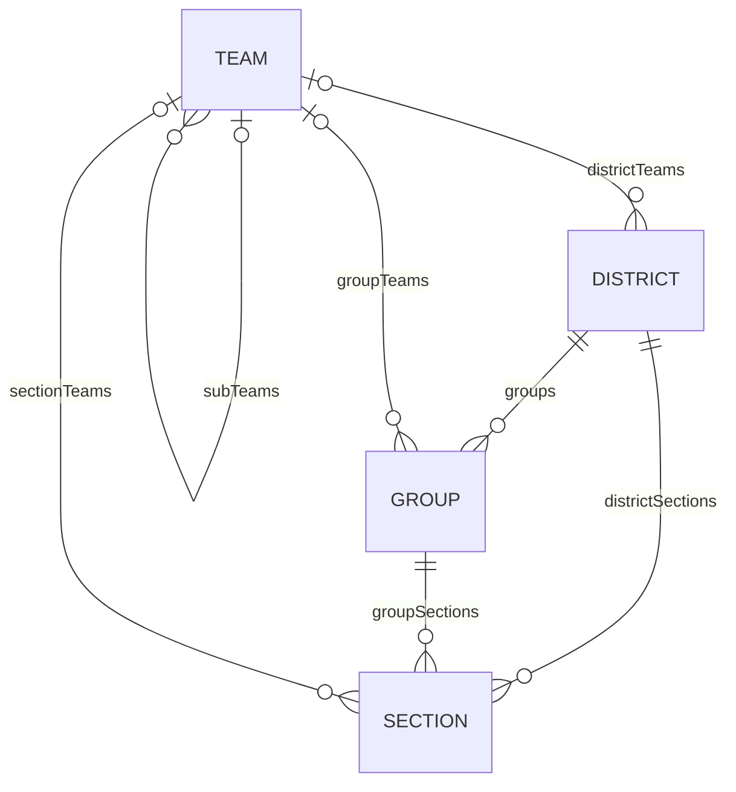
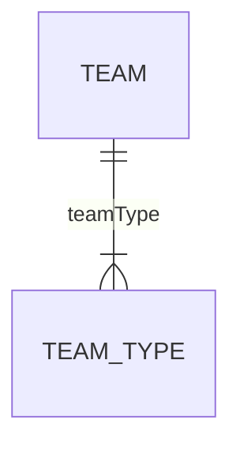
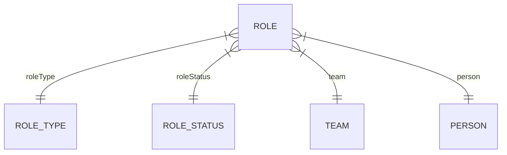
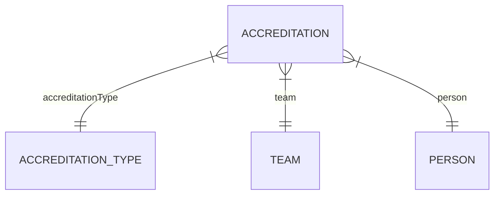

# Data Modelling

!!! note

    The Entity Relation Diagrams (ERDs) on this page are designed to explain how the Salute works under the hood.
    Names in the diagrams may not match names used in code, schemata or the user interface.

## Core Data

### Hierarchy

The hierarchy of a scout district consists of 5 entities:

* District - The Scout District, currently must have exactly one.
* Group - A Scout Group
* Section - A section. It might be at a Group (e.g Cubs, Scouts), or run by the District (e.g Explorers, Network)
* Team - A team of volunteers, linked to the relevant district, group or section.
  * A team may have sub-teams. However, this is only one layer deep, so a sub-team **cannot** have a sub-team.
  * Sections only have one team, and that team cannot have sub-teams.

### Team Types
!!! note

    TSA refers to Teams and TeamIDs, which are equivalent to TeamTypes in this project.

A team type is a globally used type for a team that has a specific purpose. For example, a Trustee Board at a District has roughly the same role as a Trustee Board in a group, as both are responsible for governance, have Chair, Treasurer, and Trustee roles, etc.

Some examples of Team Types are:

* 14-24 Team
* Beaver Section Team
* Helpers
* Leadership Team

The team type restricts what roles are available in a given team, so you could not have the `Group Lead Volunteer` role type in a `Helpers` team, it has to be in the `Leadership Team` for a Group only.

Sub-teams also have a team type, but it is not used globally. For example, the `Fundraising Team` in one group, will not have the same team type as one in another group, or the district.

Teams derive their naming from their team type.

### Roles and Accreditations

Volunteers are placed in teams via two different assignment methods: roles and accreditations.

#### Roles

Roles are the primary way that volunteers are allocated to teams.

Roles also have a status, which indicates if the volunteer has met all of the requirements for the role. We are aware of the following statuses:

* `Full` - the role is valid and all requirements have been met.
* `Provisional + System` - all requirements except learning have been met.
* `Provisional` - the role has been assigned, but requirements have not been met
* `-` - the role is automatic. For example, a `Team Leader` will have an automatic `Team Member` role in the parent team.

It is possible for a volunteer to have the same role in the same team twice, which if not automatic is likely to be a mistake in data.

#### Accreditations

>Accreditations are a way of sharing tasks and responsibilities, where a volunteer needs to be given certain permissions to take these on.
>
>They are normally specific tasks that operate wider than an individual team and often may be carried out by one or more individual volunteers.

